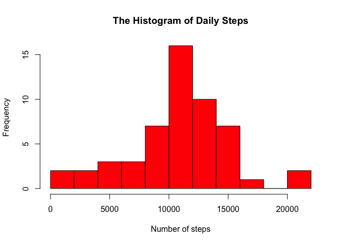
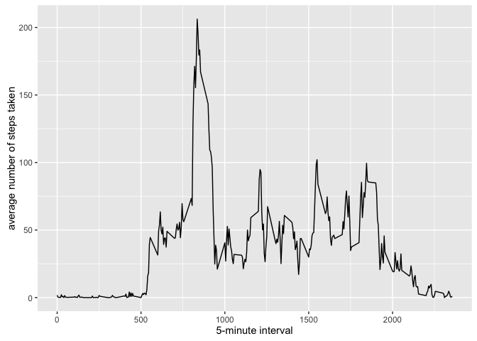
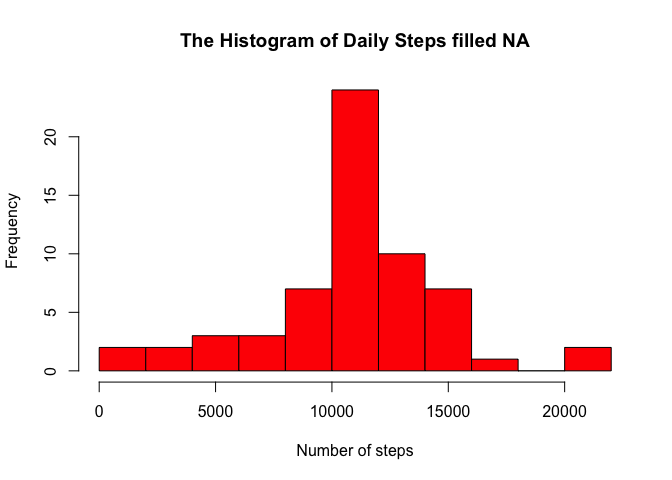

# Reproducible Research: Peer Assessment 1
It is now possible to collect a large amount of data about personal movement using activity monitoring devices such as a Fitbit, Nike Fuelband, or Jawbone Up. These type of devices are part of the “quantified self” movement – a group of enthusiasts who take measurements about themselves regularly to improve their health, to find patterns in their behavior, or because they are tech geeks.

## Loading and preprocessing the data
Load the activity data and explore it.


```r
Activity <- read.csv ("~/Desktop/RepData_PeerAssessment1/Activity.csv")
head(Activity)
```

```
##   steps       date interval
## 1    NA 2012-10-01        0
## 2    NA 2012-10-01        5
## 3    NA 2012-10-01       10
## 4    NA 2012-10-01       15
## 5    NA 2012-10-01       20
## 6    NA 2012-10-01       25
```

```r
str(Activity)
```

```
## 'data.frame':	17568 obs. of  3 variables:
##  $ steps   : int  NA NA NA NA NA NA NA NA NA NA ...
##  $ date    : Factor w/ 61 levels "2012-10-01","2012-10-02",..: 1 1 1 1 1 1 1 1 1 1 ...
##  $ interval: int  0 5 10 15 20 25 30 35 40 45 ...
```
#### Ploting the Histogram of the steps
Plotting the histogram of the daily steps using the base plot system.

```r
daily <- aggregate(steps ~ date, data = Activity, sum, na.rm = TRUE)
hist(daily$steps,breaks = 15, main = "The Histogram of Daily Steps", xlab = "Number of steps", col = "red")
```



## What is mean total number of steps taken per day?
The mean and the median of the daily data aggregated earlier is calculated and printed.

```r
Mean <- mean(daily$steps)
print(paste("The mean of daily activity is", round(Mean, 3)))
```

```
## [1] "The mean of daily activity is 10766.189"
```

```r
Median <- median(daily$steps)
print(paste("The median of daily activity is", Median))
```

```
## [1] "The median of daily activity is 10765"
```

## What is the average daily activity pattern?

Calculating the average of daily activity pattern and plot it to understand the pattern. 


```r
library(ggplot2)
steps.per.interval <- aggregate(steps ~ interval, data = Activity, mean, na.rm = TRUE)
ggplot(data=steps.per.interval, aes(x=interval, y=steps)) +
    geom_line() +
    xlab("5-minute interval") +
    ylab("average number of steps taken")
```



Calculating the max value of the 5 minute interval 

```r
steps.per.interval[which.max(steps.per.interval$steps),]
```

```
##     interval    steps
## 104      835 206.1698
```
## Imputing missing values
Note that there are a number of days/intervals where there are missing values (coded as 𝙽𝙰). The presence of missing days may introduce bias into some calculations or summaries of the data.

Calculating the number of NA in the steps

```r
sum_of_na <- sum (is.na(Activity$steps))
sum_of_na/length(Activity$steps)    # the percentage of NA to the total data
```

```
## [1] 0.1311475
```

Filling the missing data using the mean of interval calculated earlier data 


```r
fill.value <- function(steps, interval) {
    filled <- NA
    if (!is.na(steps))
        filled <- c(steps)
    else
        filled <- (steps.per.interval[steps.per.interval$interval==interval, "steps"])
    return(filled)
}
filled.NA<- Activity
filled.NA$steps <- mapply(fill.value, filled.NA$steps, filled.NA$interval)
```

Calculating the mean and median of daily data after filling the NA values


```r
filled.daily <- aggregate(steps ~ date, data = filled.NA, sum, na.rm = TRUE)
filled.mean <- mean(filled.daily$steps)
filled.median <- median(filled.daily$steps)

print(paste("The mean of the original data is",round(Mean, 5), "and the mean of the data after filling the NA is",round(filled.mean, 5)))
```

```
## [1] "The mean of the original data is 10766.18868 and the mean of the data after filling the NA is 10766.18868"
```

```r
print(paste("The median of the original data is",Median, "and the median of the data after filling the NA is",round(filled.median,5 )))
```

```
## [1] "The median of the original data is 10765 and the median of the data after filling the NA is 10766.18868"
```

Ploting the histogram after filling the NA values

```r
hist(filled.daily$steps,breaks = 15, main = "The Histogram of Daily Steps filled NA", xlab = "Number of steps", col = "red")
```



From the result, it can be seen that the filling of the NA field is not affecting the result significantly as they don't constitute a high percentage of the whole data. 

## Are there differences in activity patterns between weekdays and weekends?
